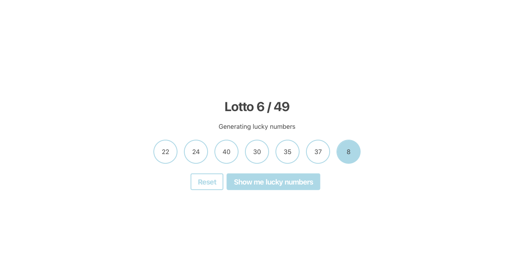
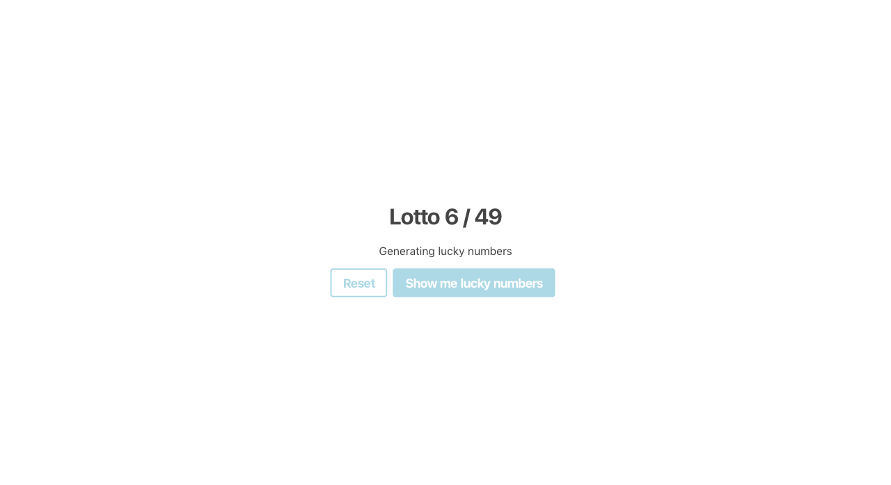

# Lotto numbers

Let's create a Lottery!

## Rules

- Your page should display 2 buttons
- Use class based components for this one!
- When you click (Show me lucky numbers), 6 numbers between 1 and 49 should be generated and displayed. All of the 6 numbers must be unique.
- In addition one extra number between 1 and 10 should be generated and displayed
- Every time you click the button a new set of lucky numbers should be generated and displayed.
- Clicking on the Reset button should hide all the numbers

